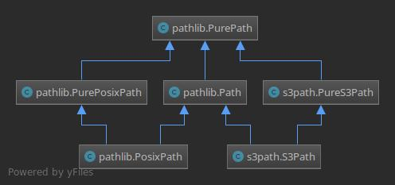

Concrete paths:
===============

Full basic Path documentation linked here: `PathDocs`_.

.. _S3Path:

S3Path(\*pathsegments)
^^^^^^^^^^^^^^^^^^^^^^

A subclass of `Path`_ and PureS3Path_, this class represents a concrete paths of AWS S3 Service.
All actions are use `boto3`_ as the SKD for AWS S3 Service:

.. code:: python

   >>> S3Path('/<bucket>/<key>')
   S3Path('/<bucket>/<key>')

pathsegments are specified similarly to `Path`_.

You can't use S3Path if you doesn't have boto3 installed in your environment:

.. code:: python

   >>> import boto3
   Traceback (most recent call last):
     File "<stdin>", line 1, in <module>
   ModuleNotFoundError: No module named 'boto3'
   >>> from s3path import S3Path
   >>> S3Path('/<bucket>/<key>')
   Traceback (most recent call last):
   File "<stdin>", line 1, in <module>
   File "pathlib.py", line 798, in __new__
     % (cls.__name__,))
   NotImplementedError: cannot instantiate 'S3Path' on your system

Methods:
========

S3Path provides the following methods in addition to pure paths methods.
All the methods below will raise a `ValueError`_ if the path isn't absolute.
Many of these methods can raise a `botocore.exceptions.ClientError` if `boto3`_ call fails
(for example because the path doesn't exist).

S3Path.stat()
^^^^^^^^^^^^^

Returns information about this path (similarly to boto3's `ObjectSummary`_).
The result is looked up at each call to this method:

.. code:: python

   >>> S3Path('/pypi-proxy/boto3/index.html').stat()
   StatResult(size=188, last_modified=datetime.datetime(2018, 4, 4, 12, 26, 3, tzinfo=tzutc()))

S3Path.exists()
^^^^^^^^^^^^^^^

Whether the path points to an existing Bucket, key or key prefix:

.. code:: python

   >>> S3Path('/pypi-proxy/boto3/index.html').exists()
   True
   >>> S3Path('/pypi-proxy/boto3/').exists()
   True
   >>> S3Path('/fake-bucket/').exists()
   False

.. _S3Path.glob:

S3Path.glob(pattern)
^^^^^^^^^^^^^^^^^^^^

Glob the given relative pattern in the Bucket / key prefix represented by this path,
yielding all matching files (of any kind):

.. code:: python

   >>> bucket_path = S3Path('/pypi-proxy/')
   >>> [path for path in bucket_path.glob('boto*')]
   [S3Path('/pypi-proxy/boto3/'), S3Path('/pypi-proxy/botocore/')]
   >>> [path for path in bucket_path.glob('*/*.html')]
   [S3Path('/pypi-proxy/requests/index.html'),
    S3Path('/pypi-proxy/index.html'),
    S3Path('/pypi-proxy/botocore/index.html')]]

The "**" pattern means "this Bucket / key prefix and all sub key prefixes, recursively".
In other words, it enables recursive globbing:

.. code:: python

   >>> bucket_path = S3Path('/pypi-proxy/')
   >>> list(bucket_path.glob('**/*.html'))
   [S3Path('/pypi-proxy/requests/index.html'),
    S3Path('/pypi-proxy/index.html'),
    S3Path('/pypi-proxy/botocore/index.html')]

**NOTE:** Using the "**" pattern in large Buckets may consume an inordinate amount of time.

S3Path.is_dir()
^^^^^^^^^^^^^^^

Returns ``True`` if the path points to a Bucket or a key prefix,
``False`` if it points to a full key path.

``False`` is also returned if the path doesn’t exist.
Other errors (such as permission errors) are propagated.

S3Path.is_file()
^^^^^^^^^^^^^^^^

Returns ``True`` if the path points to a Bucket key,
``False`` if it points to Bucket or a key prefix.

``False`` is also returned if the path doesn’t exist.
Other errors (such as permission errors) are propagated.

S3Path.is_mount()
^^^^^^^^^^^^^^^^^

AWS S3 Service doesn't have mounting feature,
There for this method will always return ``False``

S3Path.is_symlink()
^^^^^^^^^^^^^^^^^^^

AWS S3 Service doesn't have symlink feature,
There for this method will always return ``False``

S3Path.is_socket()
^^^^^^^^^^^^^^^^^^

AWS S3 Service doesn't have sockets feature,
There for this method will always return ``False``

S3Path.is_fifo()
^^^^^^^^^^^^^^^^

AWS S3 Service doesn't have fifo feature,
There for this method will always return ``False``

Path.iterdir()
^^^^^^^^^^^^^^

When the path points to a Bucket or a key prefix,
yield path objects of the directory contents:

.. code:: python

   >>> bucket_path = S3Path('/pypi-proxy/')
   >>> [path for path in bucket_path.iterdir() if path.is_dir()]
   [S3Path('/pypi-proxy/requests/'),
    S3Path('/pypi-proxy/boto3/'),
    S3Path('/pypi-proxy/botocore/')]
   >>> boto3_path = bucket_path.joinpath('boto3')
   >>> [path for path in bucket_path.boto3_path()]
   [S3Path('/pypi-proxy/boto3/boto3-1.4.1.tar.gz'), S3Path('/pypi-proxy/boto3/index.html')]

S3Path.open(mode='r', buffering=-1, encoding=None, errors=None, newline=None)
^^^^^^^^^^^^^^^^^^^^^^^^^^^^^^^^^^^^^^^^^^^^^^^^^^^^^^^^^^^^^^^^^^^^^^^^^^^^^

Opens the Bucket key pointed to by the path,
returns a Key file object that you can read/write with:

.. code:: python

   >>> with S3Path('/pypi-proxy/botocore/index.html').open() as f:
   >>>     print(f.read())
   '<!DOCTYPE html>
   <html>
   <head>
       <meta charset="UTF-8">
       <title>Package Index</title>
   </head>
   <body>
       <a href="botocore-1.4.93.tar.gz">botocore-1.4.93.tar.gz</a> 
   </body>
   </html>'

S3Path.owner()
^^^^^^^^^^^^^^

Returns the name of the user owning the Bucket or key.
Similarly to boto3's `ObjectSummary`_ owner attribute

S3Path.read_bytes()
^^^^^^^^^^^^^^^^^^^

Return the binary contents of the Bucket key as a bytes object:

.. code:: python

   >>> S3Path('/test_bucket/test.txt').write_bytes(b'Binary file contents')
   >>> S3Path('/test_bucket/test.txt').read_bytes()
   b'Binary file contents'

S3Path.read_text(encoding=None, errors=None)
^^^^^^^^^^^^^^^^^^^^^^^^^^^^^^^^^^^^^^^^^^^^

Returns the decoded contents of the Bucket key as a string:

.. code:: python

   >>> S3Path('/test_bucket/test.txt').write_text('Text file contents')
   >>> S3Path('/test_bucket/test.txt').read_text()
   'Text file contents'

S3Path.rename(target)
^^^^^^^^^^^^^^^^^^^^^

Renames this file or Bucket / key prefix / key to the given target.
If target exists and is a file, it will be replaced silently if the user has permission.
If path is a key prefix, it will replace all the keys with the same prefix to the new target prefix.
target can be either a string or another S3Path_ object:

.. code:: python

   >>> path = S3Path('/test_bucket/test.txt').write_text('Text file contents')
   >>> target = S3Path('/test_bucket/new_test.txt')
   >>> path.rename(target)
   >>> target.read_text()
   'Text file contents'

S3Path.replace(target)
^^^^^^^^^^^^^^^^^^^^^^

Renames this Bucket / key prefix / key to the given target.
If target points to an existing Bucket / key prefix / key, it will be unconditionally replaced.

S3Path.rglob(pattern)
^^^^^^^^^^^^^^^^^^^^^

This is like calling S3Path.glob_ with ``"**/"`` added in front of the given relative pattern:

.. code:: python

   >>> bucket_path = S3Path('/pypi-proxy/')
   >>> list(bucket_path.rglob('*.html'))
   [S3Path('/pypi-proxy/requests/index.html'),
    S3Path('/pypi-proxy/index.html'),
    S3Path('/pypi-proxy/botocore/index.html')]

S3Path.rmdir()
^^^^^^^^^^^^^^

Removes this Bucket / key prefix. The Bucket / key prefix must be empty.

S3Path.samefile(other_path)
^^^^^^^^^^^^^^^^^^^^^^^^^^^

Returns whether this path points to the same Bucket key as other_path,
which can be either a Path object, or a string:

.. code:: python

   >>> path = S3Path('/test_bucket/test.txt')
   >>> path.samefile(S3Path('/test_bucket/test.txt'))
   True
   >>> path.samefile('/test_bucket/fake')
   False

S3Path.touch(exist_ok=True, \**kwargs)
^^^^^^^^^^^^^^^^^^^^^^^^^^^^^^^^^^^^^^

Creates a key at this given path.
If the key already exists, the function succeeds if exist_ok is true
(and its modification time is updated to the current time), otherwise `FileExistsError`_ is raised.

S3Path.write_bytes(data)
^^^^^^^^^^^^^^^^^^^^^^^^

Opens the key pointed to in bytes mode, write data to it, and close / save the key:

.. code:: python

   >>> S3Path('/test_bucket/test.txt').write_bytes(b'Binary file contents')
   >>> S3Path('/test_bucket/test.txt').read_bytes()
   b'Binary file contents'

S3Path.write_text(data, encoding=None, errors=None)
^^^^^^^^^^^^^^^^^^^^^^^^^^^^^^^^^^^^^^^^^^^^^^^^^^^

Opens the key pointed to in text mode, writes data to it, and close / save the key:

.. code:: python

   >>> S3Path('/test_bucket/test.txt').write_text('Text file contents')
   >>> S3Path('/test_bucket/test.txt').read_text()
   'Text file contents'

S3Path.mkdir(mode=0o777, parents=False, exist_ok=False)
^^^^^^^^^^^^^^^^^^^^^^^^^^^^^^^^^^^^^^^^^^^^^^^^^^^^^^^

Create a path bucket.

AWS S3 Service doesn't support folders, therefore the mkdir method will only create the current bucket.
If the bucket path already exists, FileExistsError is raised.

If exist_ok is false (the default), FileExistsError is raised if the target Bucket already exists.

If exist_ok is true, OSError exceptions will be ignored.

if parents is false (the default), mkdir will create the bucket only if this is a Bucket path.

if parents is true, mkdir will create the bucket even if the path have a Key path.

mode argument is ignored.

Pure paths:
===========

Full basic PurePath documentation linked here: `PurePathDocs`_.

.. _PureS3Path:

PureS3Path(\*pathsegments)
^^^^^^^^^^^^^^^^^^^^^^^^^^

A subclass of `PurePath`_, this path flavour represents AWS S3 Service semantics.

.. code:: python

   >>> PureS3Path('/<bucket>/<key>')
   PureS3Path('/<bucket>/<key>')

pathsegments are specified similarly to `PurePath`_.

PureS3Path has a similar behavior to `PurePosixPath`_, except for the below changes:
------------------------------------------------------------------------------------

Double dots (``'..'``) are treated as follows.
This is different then PurePath since AWS S3 Service doesn't support symbolic links:

.. code:: python

   >>> PureS3Path('foo/../bar')
   PureS3Path('bar')

**NOTE:** All The methods below will raise `ValueError`_ if the path isn't absolute.

PureS3Path.as_uri()
^^^^^^^^^^^^^^^^^^^

Represents the path as a AWS S3 URI:

.. code:: python

   >>> p = PureS3Path('/pypi-proxy/boto3/')
   >>> p.as_uri()
   's3://pypi-proxy/boto3/'
   >>> p = PureS3Path('/pypi-proxy/boto3/index.html')
   >>> p.as_uri()
   's3://pypi-proxy/boto3/index.html'

PureS3Path.from_uri(uri)
^^^^^^^^^^^^^^^^^^^^^^^^

Represents a AWS S3 URI as a PureS3Path:

.. code:: python

   >>> PureS3Path.from_uri('s3://pypi-proxy/boto3/')
   PureS3Path('/pypi-proxy/boto3/')

This is a new class method.

PureS3Path.bucket
^^^^^^^^^^^^^^^^^

The Bucket path.  If a path doesn't have a bucket, it returns ``None``:

.. code:: python

   >>> p = PureS3Path.from_uri('s3://pypi-proxy/boto3/').bucket
   PureS3Path('/pypi-proxy/')
   >>> p = PureS3Path('/').bucket
   None

This is a new property.

PureS3Path.key
^^^^^^^^^^^^^^

The Key path. If a path doesn't have a key, it returns ``None``:

.. code:: python

   >>> p = PureS3Path('/pypi-proxy/boto3/').key
   PureS3Path('boto3')
   >>> PureS3Path('/pypi-proxy/boto3/index.html').key
   PureS3Path('boto3/index.html')
   >>> p = PureS3Path.from_uri('s3://pypi-proxy/').key
   None

This is a new property.

Unsupported Methods:
====================

There are several methods that are not supported in S3Path.
All of them will raise `NotImplementedError`_.

For example AWS S3 Service doesn't have a current directory:

.. code:: python

   >>> S3Path('/test_bucket/test.txt').cwd()
   Traceback (most recent call last):
     File "<stdin>", line 1, in <module>
     File "/home/lior/lior_env/s3path/s3path.py", line 235, in cwd
   raise NotImplementedError(message)
   NotImplementedError: PathNotSupportedMixin.cwd is unsupported on AWS S3 service

Here is a list of all unsupported methods:

- classmethod S3Path.cwd()
- classmethod S3Path.home()
- S3Path.chmod(mode)
- S3Path.expanduser()
- S3Path.lchmod(mode)
- S3Path.group()
- S3Path.is_block_device()
- S3Path.is_char_device()
- S3Path.lstat()
- S3Path.resolve()
- S3Path.symlink_to(target, target_is_directory=False)
- S3Path.unlink()

.. _PurePathDocs : https://docs.python.org/3/library/pathlib.html#pure-paths
.. _PurePath : https://docs.python.org/3/library/pathlib.html#pathlib.PurePath
.. _PurePosixPath : https://docs.python.org/3/library/pathlib.html#pathlib.PurePosixPath
.. _PathDocs : https://docs.python.org/3/library/pathlib.html#concrete-paths
.. _Path : https://docs.python.org/3/library/pathlib.html#pathlib.Path
.. _boto3 : https://github.com/boto/boto3
.. _ValueError : https://docs.python.org/3/library/exceptions.html#ValueError
.. _FileExistsError : https://docs.python.org/3/library/exceptions.html#FileExistsError
.. _NotImplementedError : https://docs.python.org/3/library/exceptions.html#NotImplementedError
.. _ObjectSummary : https://boto3.amazonaws.com/v1/documentation/api/latest/reference/services/s3.html#objectsummary
