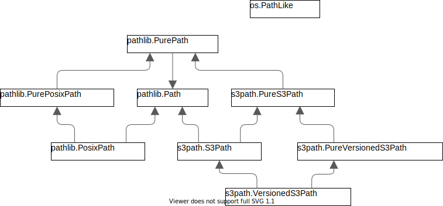

Concrete paths:
===============

Full basic Path documentation linked here: `PathDocs`_.

.. _S3Path:

S3Path(\*pathsegments)
^^^^^^^^^^^^^^^^^^^^^^

A subclass of `Path`_ and PureS3Path_, this class represents a concrete paths of AWS S3 Service.
All actions are use `boto3`_ as the SKD for AWS S3 Service:

.. code:: python

   >>> S3Path('/<bucket>/<key>')
   S3Path('/<bucket>/<key>')

pathsegments are specified similarly to `Path`_.

You can't use S3Path if you doesn't have boto3 installed in your environment:

.. code:: python

   >>> import boto3
   Traceback (most recent call last):
     File "<stdin>", line 1, in <module>
   ModuleNotFoundError: No module named 'boto3'
   >>> from s3path import S3Path
   >>> S3Path('/<bucket>/<key>')
   Traceback (most recent call last):
   File "<stdin>", line 1, in <module>
   File "pathlib.py", line 798, in __new__
     % (cls.__name__,))
   NotImplementedError: cannot instantiate 'S3Path' on your system

.. _VersionedS3Path:

VersionedS3Path(\*pathsegments, version_id)
^^^^^^^^^^^^^^^^^^^^^^^^^^^^^^^^^^^^^^^^^^^

A subclass of `S3Path`_ and `PureVersionedS3Path`_, this class represents a concrete path of the AWS
S3 Service for buckets in which `S3 versioning`_ is enabled. All actions use `boto3`_ as the SKD for
AWS S3 Service:

.. code:: python

   >>> from s3path import VersionedS3Path
   >>> VersionedS3Path('/<bucket>/<key>', version_id='<version_id>')
   VersionedS3Path('/<bucket>/<key>', version_id='<version_id>')

| pathsegments are specified similarly to `Path`_
| version_id is a string that can be any valid `AWS S3 version identifier`_
|
| New in version 0.5.0

Methods:
========

S3Path and VersionedS3Path provide the following methods in addition to pure paths methods.
All the methods below will raise a `ValueError`_ if the path isn't absolute.
Many of these methods can raise a `botocore.exceptions.ClientError` if `boto3`_ call fails
(for example because the path doesn't exist).

**NOTE:** The following signatures are shown for `S3Path`_ but are equally valid for
`VersionedS3Path`_ as well. Any behavioral differences between `S3Path`_ methods and their
`VersionedS3Path`_ equivalents are explicitly detailed below (i.e. if a given `VersionedS3Path`_
method signature is not listed below, it is assumed that it behaves identically to its `S3Path`_
equivalent).

.. _S3Path.stat:

S3Path.stat(*, follow_symlinks=True)
^^^^^^^^^^^^^^^^^^^^^^^^^^^^^^^^^^^^

Returns information about this path (similarly to boto3's `ObjectSummary`_).
For compatibility with `pathlib`_, the returned object some similar attributes like `os.stat_result`_.
The result is looked up at each call to this method:

.. code:: python

   >>> path_stat = S3Path('/pypi-proxy/boto3/index.html').stat()
   >>> path_stat
   StatResult(size=188, last_modified=datetime.datetime(2018, 4, 4, 12, 26, 3, tzinfo=tzutc()), version_id=None)
   >>> path_stat.st_size
   188
   >>> path_stat.st_mtime
   1522833963.0
   >>> print(path_stat.st_version_id)
   None
   >>> path_stat.st_atime
   Traceback (most recent call last):
   ...
   io.UnsupportedOperation: StatResult do not support st_atime attribute

**NOTES:**

* ``follow_symlinks`` option must be always set to ``True``.
* The returned object will contain an additional ``st_version_id`` attribute that is not part of the
`os.stat_result`_ API. The value of ``st_version_id`` will be ``None``.

VersionedS3Path.stat(*, follow_symlinks=True)
^^^^^^^^^^^^^^^^^^^^^^^^^^^^^^^^^^^^^^^^^^^^^

Behaves the same as `S3Path.stat`_ with the exception that the ``st_version_id`` attribute of the
returned object will contain the version ID of the underlying S3 object.

.. _S3Path.exists:

S3Path.exists()
^^^^^^^^^^^^^^^

Whether the path points to an existing Bucket, key or key prefix:

.. code:: python

   >>> S3Path('/pypi-proxy/boto3/index.html').exists()
   True
   >>> S3Path('/pypi-proxy/boto3/').exists()
   True
   >>> S3Path('/fake-bucket/').exists()
   False

VersionedS3Path.exists()
^^^^^^^^^^^^^^^^^^^^^^^^

Behaves the same as `S3Path.exists`_ except that the version ID must match in addition to the bucket
and key.

.. _S3Path.glob:

S3Path.glob(pattern)
^^^^^^^^^^^^^^^^^^^^

Glob the given relative pattern in the Bucket / key prefix represented by this path,
yielding all matching files (of any kind):

.. code:: python

   >>> bucket_path = S3Path('/pypi-proxy/')
   >>> [path for path in bucket_path.glob('boto*')]
   [S3Path('/pypi-proxy/boto3/'), S3Path('/pypi-proxy/botocore/')]
   >>> [path for path in bucket_path.glob('*/*.html')]
   [S3Path('/pypi-proxy/requests/index.html'),
    S3Path('/pypi-proxy/boto3/index.html'),
    S3Path('/pypi-proxy/botocore/index.html')]]

The "**" pattern means "this Bucket / key prefix and all sub key prefixes, recursively".
In other words, it enables recursive globbing:

.. code:: python

   >>> bucket_path = S3Path('/pypi-proxy/')
   >>> list(bucket_path.glob('**/*.html'))
   [S3Path('/pypi-proxy/requests/index.html'),
    S3Path('/pypi-proxy/index.html'),
    S3Path('/pypi-proxy/boto3/index.html'),
    S3Path('/pypi-proxy/botocore/index.html')]

In version 0.4.0:
New Algorithm that better suited to s3 API.
Especially for recursive searches.

To enable the old (pathlib common) Algorithm you can configure it like this:

.. code:: python

        register_configuration_parameter(path, glob_new_algorithm=False)

New version 0.6.0:
glob implementation will work only with the new algorithm, there for the glob_new_algorithm arg is in depreciation cycle

For more configuration details please see this `Advanced S3Path configuration`_

**NOTE:** Using the "**" pattern in large Buckets may consume an inordinate amount of time in the old algorithm.

S3Path.is_dir()
^^^^^^^^^^^^^^^

Returns ``True`` if the path points to a Bucket or a key prefix,
``False`` if it points to a full key path.

``False`` is also returned if the path doesn’t exist.
Other errors (such as permission errors) are propagated.

S3Path.is_file()
^^^^^^^^^^^^^^^^

Returns ``True`` if the path points to a Bucket key,
``False`` if it points to Bucket or a key prefix.

``False`` is also returned if the path doesn’t exist.
Other errors (such as permission errors) are propagated.

S3Path.is_mount()
^^^^^^^^^^^^^^^^^

AWS S3 Service doesn't have mounting feature,
There for this method will always return ``False``

S3Path.is_symlink()
^^^^^^^^^^^^^^^^^^^

AWS S3 Service doesn't have symlink feature,
There for this method will always return ``False``

S3Path.is_socket()
^^^^^^^^^^^^^^^^^^

AWS S3 Service doesn't have sockets feature,
There for this method will always return ``False``

S3Path.is_fifo()
^^^^^^^^^^^^^^^^

AWS S3 Service doesn't have fifo feature,
There for this method will always return ``False``

Path.iterdir()
^^^^^^^^^^^^^^

When the path points to a Bucket or a key prefix,
yield path objects of the directory contents:

.. code:: python

   >>> bucket_path = S3Path('/pypi-proxy/')
   >>> [path for path in bucket_path.iterdir() if path.is_dir()]
   [S3Path('/pypi-proxy/requests/'),
    S3Path('/pypi-proxy/boto3/'),
    S3Path('/pypi-proxy/botocore/')]
   >>> boto3_path = bucket_path.joinpath('boto3')
   >>> [path for path in bucket_path.boto3_path()]
   [S3Path('/pypi-proxy/boto3/boto3-1.4.1.tar.gz'), S3Path('/pypi-proxy/boto3/index.html')]

.. _S3Path.open:

S3Path.open(mode='r', buffering=-1, encoding=None, errors=None, newline=None)
^^^^^^^^^^^^^^^^^^^^^^^^^^^^^^^^^^^^^^^^^^^^^^^^^^^^^^^^^^^^^^^^^^^^^^^^^^^^^

Opens the Bucket key pointed to by the path.
This delegates to the smart_open library that handles the file streaming.
returns a file like object that you can read or write with:

.. code:: python

   >>> with S3Path('/pypi-proxy/botocore/index.html').open() as f:
   >>>     print(f.read())
   '<!DOCTYPE html>
   <html>
   <head>
       <meta charset="UTF-8">
       <title>Package Index</title>
   </head>
   <body>
       <a href="botocore-1.4.93.tar.gz">botocore-1.4.93.tar.gz</a> 
   </body>
   </html>'

VersionedS3Path.open(mode='r', buffering=-1, encoding=None, errors=None, newline=None)
^^^^^^^^^^^^^^^^^^^^^^^^^^^^^^^^^^^^^^^^^^^^^^^^^^^^^^^^^^^^^^^^^^^^^^^^^^^^^^^^^^^^^^

Behaves the same as `S3Path.open`_ except that ``VersionedS3Path.version_id`` will be used to open
the specified version of the object pointed to by the `VersionedS3Path`_ object.

S3Path.owner()
^^^^^^^^^^^^^^

Returns the name of the user owning the Bucket or key.
Similarly to boto3's `ObjectSummary`_ owner attribute

S3Path.read_bytes()
^^^^^^^^^^^^^^^^^^^

Return the binary contents of the Bucket key as a bytes object:

.. code:: python

   >>> S3Path('/test_bucket/test.txt').write_bytes(b'Binary file contents')
   >>> S3Path('/test_bucket/test.txt').read_bytes()
   b'Binary file contents'

S3Path.read_text(encoding=None, errors=None)
^^^^^^^^^^^^^^^^^^^^^^^^^^^^^^^^^^^^^^^^^^^^

Returns the decoded contents of the Bucket key as a string:

.. code:: python

   >>> S3Path('/test_bucket/test.txt').write_text('Text file contents')
   >>> S3Path('/test_bucket/test.txt').read_text()
   'Text file contents'

S3Path.rename(target)
^^^^^^^^^^^^^^^^^^^^^

Renames this file or Bucket / key prefix / key to the given target.
If target exists and is a file, it will be replaced silently if the user has permission.
If path is a key prefix, it will replace all the keys with the same prefix to the new target prefix.
target can be either a string or another S3Path_ object:

.. code:: python

   >>> path = S3Path('/test_bucket/test.txt').write_text('Text file contents')
   >>> target = S3Path('/test_bucket/new_test.txt')
   >>> path.rename(target)
   >>> target.read_text()
   'Text file contents'

S3Path.replace(target)
^^^^^^^^^^^^^^^^^^^^^^

Renames this Bucket / key prefix / key to the given target.
If target points to an existing Bucket / key prefix / key, it will be unconditionally replaced.

S3Path.rglob(pattern)
^^^^^^^^^^^^^^^^^^^^^

This is like calling S3Path.glob_ with ``"**/"`` added in front of the given relative pattern:

.. code:: python

   >>> bucket_path = S3Path('/pypi-proxy/')
   >>> list(bucket_path.rglob('*.html'))
   [S3Path('/pypi-proxy/requests/index.html'),
    S3Path('/pypi-proxy/index.html'),
    S3Path('/pypi-proxy/botocore/index.html')]

Version 0.4.0:
New Algorithm that better suited to s3 API.
Especially for recursive searches.

New version 0.6.0:
glob implementation will work only with the new algorithm, there for the glob_new_algorithm arg is in depreciation cycle

S3Path.rmdir()
^^^^^^^^^^^^^^

Removes this Bucket / key prefix. The Bucket / key prefix must be empty.

S3Path.unlink(missing_ok=False)
^^^^^^^^^^^^^^^

Removes this key from S3. Note that this will not remove directories or buckets, but will
instead raise an `IsADirectoryError`_. If the key does is not present in the given bucket,
or if the bucket is not present, raises a `FileNotFoundError`_.
If `missing_ok` is `True` then no exception will be raised.

S3Path.samefile(other_path)
^^^^^^^^^^^^^^^^^^^^^^^^^^^

Returns whether this path points to the same Bucket key as other_path,
which can be either a Path object, or a string:

.. code:: python

   >>> path = S3Path('/test_bucket/test.txt')
   >>> path.samefile(S3Path('/test_bucket/test.txt'))
   True
   >>> path.samefile('/test_bucket/fake')
   False

S3Path.touch(exist_ok=True, \**kwargs)
^^^^^^^^^^^^^^^^^^^^^^^^^^^^^^^^^^^^^^

Creates a key at this given path.
If the key already exists, the function succeeds if exist_ok is true
(and its modification time is updated to the current time), otherwise `FileExistsError`_ is raised.

S3Path.write_bytes(data)
^^^^^^^^^^^^^^^^^^^^^^^^

Opens the key pointed to in bytes mode, write data to it, and close / save the key:

.. code:: python

   >>> S3Path('/test_bucket/test.txt').write_bytes(b'Binary file contents')
   >>> S3Path('/test_bucket/test.txt').read_bytes()
   b'Binary file contents'

S3Path.write_text(data, encoding=None, errors=None, newline=None)
^^^^^^^^^^^^^^^^^^^^^^^^^^^^^^^^^^^^^^^^^^^^^^^^^^^^^^^^^^^^^^^^^

Opens the key pointed to in text mode, writes data to it, and close / save the key:

.. code:: python

   >>> S3Path('/test_bucket/test.txt').write_text('Text file contents')
   >>> S3Path('/test_bucket/test.txt').read_text()
   'Text file contents'

**NOTE:** ``newline`` option is only available on Python 3.10 and greater.

S3Path.mkdir(mode=0o777, parents=False, exist_ok=False)
^^^^^^^^^^^^^^^^^^^^^^^^^^^^^^^^^^^^^^^^^^^^^^^^^^^^^^^

Create a path bucket.

AWS S3 Service doesn't support folders, therefore the mkdir method will only create the current bucket.
If the bucket path already exists, FileExistsError is raised.

If exist_ok is false (the default), FileExistsError is raised if the target Bucket already exists.

If exist_ok is true, OSError exceptions will be ignored.

if parents is false (the default), mkdir will create the bucket only if this is a Bucket path.

if parents is true, mkdir will create the bucket even if the path have a Key path.

mode argument is ignored.

S3Path.get_presigned_url(expire_in: timedelta | int = 3600) -> str
^^^^^^^^^^^^^^^^^^^^^^^^^^^^^^^^^^^^^^^^^^^^^^^^^^^^^^^

Returns a pre-signed url. Anyone with the url can make a GET request to get the file.
You can set an expiration date with the expire_in argument (integer or timedelta object).

Note that generating a presigned url may require more information or setup than to use other
S3Path functions. It's because it needs to know the exact aws region and use s3v4 as signature
version. Meaning you may have to do this:

.. code:: python

    >>> import boto3
    >>> from botocore.config import Config
    >>> from s3path import S3Path, register_configuration_parameter

    >>> resource = boto3.resource(
    ...     "s3",
    ...     config=Config(signature_version="s3v4"),
    ...     region_name="the aws region name"
    ... )
    >>> register_configuration_parameter(S3Path("/"), resource=resource)

Here is an example of using a presigned url:

.. code:: python

    >>> from s3path import S3Path
    >>> import requests

    >>> file = S3Path("/my-bucket/toto.txt")
    >>> file.write_text("hello world")

    >>> presigned_url = file.get_presigned_url()
    >>> print(requests.get(presigned_url).content)
    b"hello world"

Pure paths:
===========

Full basic PurePath documentation linked here: `PurePathDocs`_.

.. _PureS3Path:

PureS3Path(\*pathsegments)
^^^^^^^^^^^^^^^^^^^^^^^^^^

A subclass of `PurePath`_, this path flavour represents AWS S3 Service semantics.

.. code:: python

   >>> PureS3Path('/<bucket>/<key>')
   PureS3Path('/<bucket>/<key>')

pathsegments are specified similarly to `PurePath`_.

.. _PureVersionedS3Path:

PureVersionedS3Path(\*pathsegments, version_id)
^^^^^^^^^^^^^^^^^^^^^^^^^^^^^^^^^^^^^^^^^^^^^^^

A subclass of `PureS3Path`_, this path flavour represents AWS S3 Service semantics for buckets in which `S3 versioning`_ is enabled.

.. code:: python

   >>> from s3path import PureVersionedS3Path
   >>> PureVersionedS3Path('/<bucket>/<key>', version_id='<version_id>')
   PureVersionedS3Path('/<bucket>/<key>', version_id='<version_id>')

| pathsegments are specified similarly to `PurePath`_.
| version_id is a string that can be any valid `AWS S3 version identifier`_
|
| New in version 0.5.0

PureS3Path has a similar behavior to `PurePosixPath`_, except for the below changes:
------------------------------------------------------------------------------------

Double dots (``'..'``) are treated as follows.
This is different then PurePath since AWS S3 Service doesn't support symbolic links:

.. code:: python

   >>> PureS3Path('foo/../bar')
   PureS3Path('bar')

**NOTE:** All The methods below will raise `ValueError`_ if the path isn't absolute.

PureS3Path.joinpath(*other)
^^^^^^^^^^^^^^^^^^^^^^^^^^^

If the final element of ``other`` is a `PureVersionedS3Path`_ instance, the resulting object will
also be a `PureVersionedS3Path`_ instance with ``version_id`` set to ``other[-1].version_id``.
Otherwise, the resulting object will be a `PureS3Path`_ instance.

PureS3Path.as_uri()
^^^^^^^^^^^^^^^^^^^

Represents the path as a AWS S3 URI:

.. code:: python

   >>> p = PureS3Path('/pypi-proxy/boto3/')
   >>> p.as_uri()
   's3://pypi-proxy/boto3/'
   >>> p = PureS3Path('/pypi-proxy/boto3/index.html')
   >>> p.as_uri()
   's3://pypi-proxy/boto3/index.html'

PureS3Path.from_uri(uri)
^^^^^^^^^^^^^^^^^^^^^^^^

Represents a AWS S3 URI as a PureS3Path:

.. code:: python

   >>> PureS3Path.from_uri('s3://pypi-proxy/boto3/index.html')
   PureS3Path('/pypi-proxy/boto3/index.html')

This is a new class method.

PureS3Path.from_bucket_key(bucket, key)
^^^^^^^^^^^^^^^^^^^^^^^^^^^^^^^^^^^^^^^

Represents a AWS S3 Bucket and Key pairs as a PureS3Path:

.. code:: python

   >>> PureS3Path.from_bucket_key('pypi-proxy', 'boto3/index.html')
   PureS3Path('/pypi-proxy/boto3/index.html')

This is a new class method.

New in version 0.3.0.

PureS3Path.bucket
^^^^^^^^^^^^^^^^^

A string representing the AWS S3 Bucket name, if any:

.. code:: python

   >>> PureS3Path.from_uri('s3://pypi-proxy/boto3/').bucket
   'pypi-proxy'
   >>> PureS3Path('/').bucket
   ''

This is a new property.

PureS3Path.key
^^^^^^^^^^^^^^

A string representing the AWS S3 Key name, if any:

.. code:: python

   >>> PureS3Path('/pypi-proxy/boto3/').key
   'boto3'
   >>> PureS3Path('/pypi-proxy/boto3/index.html').key
   'boto3/index.html'
   >>> PureS3Path.from_uri('s3://pypi-proxy/').key
   ''

This is a new property.

PureVersionedS3Path has a similar behavior to `PureS3Path`_, except for the below changes:
------------------------------------------------------------------------------------------

PureVersionedS3Path.from_uri(uri, *, version_id)
^^^^^^^^^^^^^^^^^^^^^^^^^^^^^^^^^^^^^^^^^^^^^^^^

Represents a versioned AWS S3 URI as a `PureVersionedS3Path`_:

.. code:: python

   >>> from s3path import PureVersionedS3Path
   >>> PureVersionedS3Path.from_uri('s3://pypi-proxy/boto3/index.html', version_id='<version_id>')
   PureVersionedS3Path('/pypi-proxy/boto3/index.html', version_id='<version_id>')

This is a new class method.

PureVersionedS3Path.from_bucket_key(bucket, key, *, version_id)
^^^^^^^^^^^^^^^^^^^^^^^^^^^^^^^^^^^^^^^^^^^^^^^^^^^^^^^^^^^^^^^

Represents a versioned AWS S3 Bucket and Key pairs as a `PureVersionedS3Path`_:

.. code:: python

   >>> from s3path import PureVersionedS3Path
   >>> PureVersionedS3Path.from_bucket_key('pypi-proxy', 'boto3/index.html', version_id='<version_id>')
   PureVersionedS3Path('/pypi-proxy/boto3/index.html', version_id='<version_id>')

This is a new class method.

Division Operator with PureVersionedS3Path
^^^^^^^^^^^^^^^^^^^^^^^^^^^^^^^^^^^^^^^^^^

The division of `PureVersionedS3Path`_ instances with other objects will yield the following types:

* ``PureVersionedS3Path / PureVersionedS3Path -> PureVersionedS3Path``
* ``PureS3Path / PureVersionedS3Path -> PureVersionedS3Path``
* ``str / PureVersionedS3Path -> PureVersionedS3Path``
* ``PureVersionedS3Path / PureS3Path -> PureS3Path``
* ``PureVersionedS3Path / str -> PureS3Path``

.. code:: python

   >>> from s3path import S3Path, VersionedS3Path
   >>> str_path = "example/path"
   >>> s3_path = S3Path("example/path")
   >>> versioned_s3_path = VersionedS3Path("example/path", version_id="<version_id>")
   >>> type(versioned_s3_path / versioned_s3_path)
   <<< s3path.VersionedS3Path
   >>> type(s3_path / versioned_s3_path)
   <<< s3path.VersionedS3Path
   >>> type(str_path / versioned_s3_path)
   <<< s3path.VersionedS3Path
   >>> type(versioned_s3_path / s3_path)
   <<< s3path.S3Path
   >>> type(versioned_s3_path / str_path)
   <<< s3path.S3Path

Unsupported Methods:
====================

There are several methods that are not supported in S3Path.
All of them will raise `NotImplementedError`_.

For example AWS S3 Service doesn't have a current directory:

.. code:: python

   >>> S3Path('/test_bucket/test.txt').cwd()
   Traceback (most recent call last):
     File "<stdin>", line 1, in <module>
     File "/home/lior/lior_env/s3path/s3path.py", line 235, in cwd
   raise NotImplementedError(message)
   NotImplementedError: PathNotSupportedMixin.cwd is unsupported on AWS S3 service

Here is a list of all unsupported methods:

- classmethod S3Path.cwd()
- classmethod S3Path.home()
- S3Path.chmod(mode, *, follow_symlinks=True)
- S3Path.expanduser()
- S3Path.lchmod(mode)
- S3Path.group()
- S3Path.is_block_device()
- S3Path.is_char_device()
- S3Path.lstat()
- S3Path.resolve()
- S3Path.symlink_to(target, target_is_directory=False)

.. _pathlib : https://docs.python.org/3/library/pathlib.html
.. _os.stat_result : https://docs.python.org/3/library/os.html#os.stat_result
.. _PurePathDocs : https://docs.python.org/3/library/pathlib.html#pure-paths
.. _PurePath : https://docs.python.org/3/library/pathlib.html#pathlib.PurePath
.. _PurePosixPath : https://docs.python.org/3/library/pathlib.html#pathlib.PurePosixPath
.. _PathDocs : https://docs.python.org/3/library/pathlib.html#concrete-paths
.. _Path : https://docs.python.org/3/library/pathlib.html#pathlib.Path
.. _boto3 : https://github.com/boto/boto3
.. _ValueError : https://docs.python.org/3/library/exceptions.html#ValueError
.. _FileExistsError : https://docs.python.org/3/library/exceptions.html#FileExistsError
.. _IsADirectoryError : https://docs.python.org/3/library/exceptions.html#IsADirectoryError
.. _NotImplementedError : https://docs.python.org/3/library/exceptions.html#NotImplementedError
.. _ObjectSummary : https://boto3.amazonaws.com/v1/documentation/api/latest/reference/services/s3.html#objectsummary
.. _Abstract pathlib interface: https://github.com/liormizr/s3path/blob/master/docs/interface.rst
.. _S3 versioning : https://docs.aws.amazon.com/AmazonS3/latest/userguide/versioning-workflows.html
.. _AWS S3 version identifier : https://docs.aws.amazon.com/AmazonS3/latest/userguide/versioning-workflows.html#version-ids
